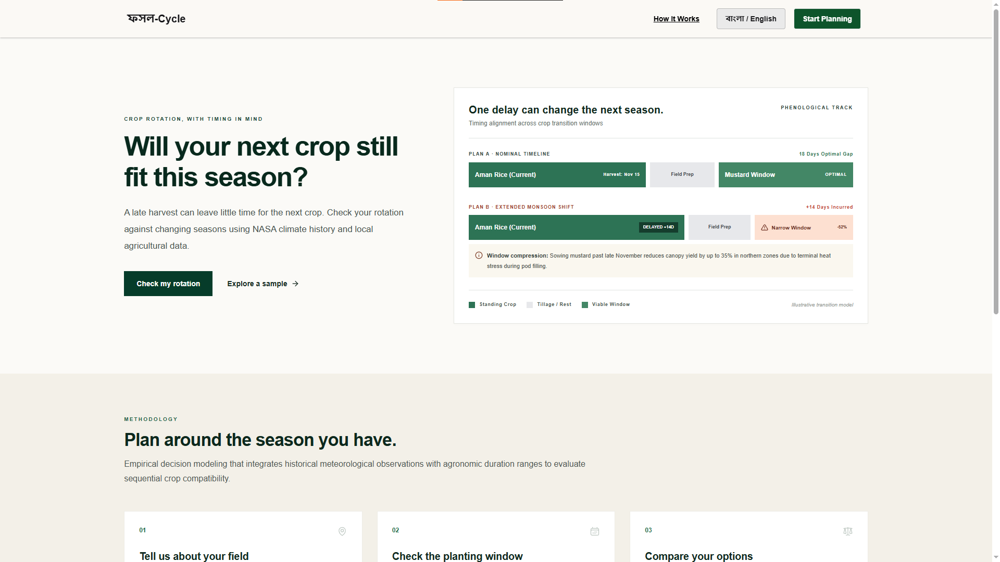

# ফসল-Cycle

**Climate-aware crop rotation planning for better seasonal decisions.**

ফসল-Cycle is a decision-support web application designed to help farmers understand whether their **next crop can still fit within the available planting window** when the current season is delayed.

Instead of only recommending _what_ to grow, ফসল-Cycle focuses on **when the field becomes available**, how that timing changes under different seasonal conditions, and whether the next crop remains viable.

> **Core question:**  
> _Will your next crop still fit this season?_

---

## Preview



---

## The Problem

Crop rotation decisions are highly sensitive to timing.

A delayed monsoon, late harvest, prolonged field moisture, or slower field preparation can compress the planting window for the next crop. Even when a crop is normally suitable for a region, it may no longer be the best option if the previous crop releases the field too late.

Farmers therefore need more than a generic crop recommendation. They need to know:

- when the current crop is likely to leave the field,
- how much preparation time is required,
- when the next crop should ideally be planted,
- how much of that planting window remains,
- and what alternatives are available if the original plan becomes risky.

---

## Our Solution

ফসল-Cycle evaluates crop-to-crop transitions using historical climate information, local agricultural knowledge, crop-duration ranges, and farmer inputs.

The system is designed around a simple workflow:

1. **Tell us about your field**  
   Provide the location, current crop, field conditions, and intended next crop.

2. **Check the planting window**  
   Estimate whether the next crop still fits after harvest and field-preparation delays.

3. **Compare your options**  
   If the original plan becomes compressed or unviable, compare alternative crops or shorter-duration varieties.

---

## Key Features

### Crop transition timeline

Visualizes the current crop, field-preparation period, and viable planting window for the next crop.

### Delay simulation

Compares a normal seasonal timeline with delayed scenarios such as an extended monsoon or late harvest.

### Planting-window analysis

Shows whether the next crop is:

- viable,
- compressed,
- missed,
- or uncertain due to insufficient information.

### Alternative crop comparison

Helps compare alternative crops or shorter-duration varieties when the original planting window becomes narrow.

### Climate-informed decisions

Uses historical meteorological observations to contextualize seasonal timing and risk.

### Local agricultural context

Designed to combine climate history with crop calendars, crop-duration ranges, and agricultural guidance relevant to Bangladesh.

---

## Methodology

ফসল-Cycle is built around **timing compatibility between sequential crops**.

Conceptually, the system evaluates:

```text
Field Release Date
        +
Field Preparation / Turnaround Time
        ↓
Expected Planting Date
        ↓
Compare with Next Crop's Viable Planting Window
```

A simplified decision model can be represented as:

```text
Next Crop Status =
    VIABLE       → planting date falls comfortably inside the recommended window
    COMPRESSED   → planting date still fits, but the remaining window is narrow
    MISSED       → planting date falls outside the recommended window
    UNKNOWN      → available evidence is insufficient for a reliable result
```

This approach keeps the system focused on a specific decision:

> **Does the planned crop rotation still fit after real-world seasonal delays?**

---

## Data Approach

The project is designed to combine multiple sources rather than relying on a single dataset.

### NASA climate data

NASA POWER can provide long-term meteorological observations such as:

- precipitation,
- temperature,
- solar radiation,
- and other climate variables.

These observations can be used to establish historical climate baselines and evaluate how seasonal timing may shift.

### Local agricultural data

Local crop calendars, crop-duration ranges, agricultural extension guidance, and agronomy reports can provide the context required to interpret climate data for realistic crop transitions.

Potential local sources include:

- Bangladesh Agricultural Research Institute (**BARI**)
- Bangladesh Rice Research Institute (**BRRI**)
- Bangladesh Agricultural Research Council (**BARC**)
- local agricultural extension material
- verified agronomy literature

> Historical observations are used for decision support and scenario analysis.  
> The system is **not intended to provide guaranteed yield predictions or replace professional agricultural advice**.

---

## Tech Stack

### Frontend

- **React.js**
- **Tailwind CSS**
- **React Icons**

### Backend

- **Node.js**
- **Express.js**

### Database

- **MongoDB**

### Authentication

- **Firebase Authentication**

### AI & Automation

- **Gemini API**
- **n8n**

### Image / File Hosting

- **ImgBB**

### Deployment

- **Vercel**
- **Netlify**

---

## High-Level Architecture

```text
                    ┌──────────────────────┐
                    │      React.js UI     │
                    │   + Tailwind CSS     │
                    └──────────┬───────────┘
                               │
                               ▼
                    ┌──────────────────────┐
                    │   Express / Node API │
                    └──────────┬───────────┘
                               │
              ┌────────────────┼────────────────┐
              │                │                │
              ▼                ▼                ▼
      ┌───────────────┐ ┌──────────────┐ ┌───────────────┐
      │    MongoDB    │ │ Firebase Auth│ │ External Data │
      └───────────────┘ └──────────────┘ └───────┬───────┘
                                                  │
                              ┌───────────────────┼──────────────────┐
                              ▼                   ▼                  ▼
                       NASA / Climate       Agronomy Data      Gemini API
                              │                                      │
                              └──────────────────┬───────────────────┘
                                                 ▼
                                      ┌────────────────────┐
                                      │ Decision / Workflow│
                                      │      + n8n         │
                                      └────────────────────┘
```

---

## Project Structure

A possible project structure:

```text
ফসল-Cycle/
│
├── client/
│   ├── src/
│   │   ├── assets/
│   │   ├── components/
│   │   │   ├── home/
│   │   │   ├── shared/
│   │   │   ├── Navbar.jsx
│   │   │   └── Footer.jsx
│   │   ├── pages/
│   │   │   └── Home.jsx
│   │   ├── hooks/
│   │   ├── services/
│   │   ├── App.jsx
│   │   └── main.jsx
│   │
│   └── package.json
│
├── server/
│   ├── controllers/
│   ├── models/
│   ├── routes/
│   ├── services/
│   ├── middleware/
│   ├── config/
│   ├── server.js
│   └── package.json
│
├── docs/
│   └── homepage-preview.png
│
├── .gitignore
└── README.md
```

---

## Getting Started

### 1. Clone the repository

```bash
git clone https://github.com/YOUR_USERNAME/YOUR_REPOSITORY.git
cd YOUR_REPOSITORY
```

### 2. Install frontend dependencies

```bash
cd client
npm install
```

### 3. Install backend dependencies

```bash
cd ../server
npm install
```

### 4. Configure environment variables

Create the required `.env` files for the frontend and backend.

Example backend variables:

```env
PORT=5000
MONGODB_URI=your_mongodb_connection_string

GEMINI_API_KEY=your_gemini_api_key

IMGBB_API_KEY=your_imgbb_api_key
```

Example frontend variables will depend on your Firebase and API setup:

```env
VITE_API_BASE_URL=http://localhost:5000

VITE_FIREBASE_API_KEY=your_firebase_api_key
VITE_FIREBASE_AUTH_DOMAIN=your_firebase_auth_domain
VITE_FIREBASE_PROJECT_ID=your_firebase_project_id
VITE_FIREBASE_STORAGE_BUCKET=your_firebase_storage_bucket
VITE_FIREBASE_MESSAGING_SENDER_ID=your_firebase_messaging_sender_id
VITE_FIREBASE_APP_ID=your_firebase_app_id
```

> Never commit real API keys or secrets to GitHub.

---

## Run Locally

Start the backend:

```bash
cd server
npm run dev
```

Start the frontend in another terminal:

```bash
cd client
npm run dev
```

Then open the local URL shown by your frontend development server.

---

## Example User Journey

```text
User selects location
        ↓
Adds current crop
        ↓
Adds expected / actual harvest timing
        ↓
Selects desired next crop
        ↓
System checks historical seasonal conditions
        ↓
Adds field-preparation / transition time
        ↓
Compares expected planting date with crop window
        ↓
Returns:
    ✓ Viable
    ⚠ Compressed
    ✕ Missed
    ? Unknown
        ↓
Suggests alternatives when necessary
```

---

## Design Philosophy

The interface is intentionally designed to feel like a **decision-support tool rather than a generic AI dashboard**.

The visual system uses:

- warm neutral backgrounds,
- agricultural green as the primary color,
- restrained use of status colors,
- square and lightly bordered UI surfaces,
- minimal shadows,
- strong information hierarchy,
- timeline-based visual explanations,
- and compact scientific / methodological annotations.

The goal is to make complex seasonal reasoning understandable without overwhelming the user.

---

## Current Scope

The initial version focuses on a narrow but important problem:

> **How does a delayed season affect whether the next crop can still be planted within its viable window?**

The MVP can begin with:

- one target region,
- a limited set of local crops,
- verified crop calendars,
- historical climate observations,
- rule-based planting-window evaluation,
- and a clear explanation of how each decision was reached.

This keeps the system testable and evidence-driven before expanding to more regions, crops, and advanced models.

---

## Future Improvements

Possible future work includes:

- district and upazila-level expansion,
- additional crop varieties,
- soil-condition integration,
- dynamic crop calendars,
- rainfall anomaly analysis,
- heat-stress indicators,
- farmer preference weighting,
- economic comparison between alternatives,
- Bengali-first user experience,
- regional dialect support,
- expert validation workflows,
- explainable AI assistance,
- offline / low-bandwidth support,
- and farmer feedback loops.

---

## Important Disclaimer

ফসল-Cycle is a **decision-support system**.

Its outputs should be interpreted as guidance based on available climate and agricultural evidence. Results may vary depending on actual weather, field conditions, crop variety, management practices, irrigation, soil characteristics, pests, diseases, and other local factors.

The platform should not be treated as a substitute for local agricultural experts or official agricultural advisories.

---

## NASA Space Apps Challenge

ফসল-Cycle is being developed in the context of the **NASA International Space Apps Challenge**, exploring how Earth-observation and climate information can support practical agricultural decision-making.

The project aims to translate climate observations into a farmer-facing question that is simple to understand:

> **If this season runs late, what happens to the next one?**

---

## Team

**Team Cygnus**

Built as a collaborative project involving software development, AI, agricultural research, product design, and storytelling.

---

## License

Add the license that best fits your project before public release.

For example:

```text
MIT License
```

---

<p align="center">
  <strong>ফসল-Cycle</strong><br/>
  Plan around the season you have.
</p>
